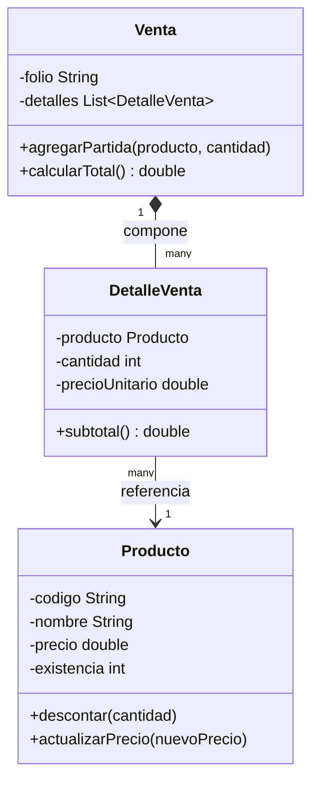

# tcsw-ventas — P01/P02. Ambiente reproducible, Producto y Venta

Prototipo de ventas para la Experiencia Educativa **Tecnologias para la
Construccion de Software** (TCSW-19234).

- **P01** (modulo **M01. Ambiente y bases de POO**): preparar un ambiente
  Java reproducible y construir la primera entidad del prototipo,
  `Producto`.
- **P02** (modulo **M02. Modelado orientado a objetos**): modelar una venta
  en memoria con objetos colaborantes — `DetalleVenta` y `Venta` — sobre el
  `Producto` construido en P01.

## Contenido del repositorio

```
tcsw-ventas/
├── pom.xml                     Proyecto Maven (JUnit 5)
├── Dockerfile                  Ambiente reproducible por contenedor
├── scripts/verify-module.sh    Script de verificacion (mvn clean test, M01/M02)
├── src/main/java/.../Producto.java       Entidad Producto (P01, encapsulada)
├── src/main/java/.../DetalleVenta.java   Objeto de valor: linea de venta (P02)
├── src/main/java/.../Venta.java          Entidad Venta, compone DetalleVenta (P02)
├── src/test/java/.../ProductoTest.java       Pruebas de Producto (P01)
├── src/test/java/.../DetalleVentaTest.java   Pruebas de DetalleVenta (P02)
├── src/test/java/.../VentaTest.java          Pruebas de Venta (P02)
└── README.md
```

## 1. Requisitos del ambiente

| Herramienta | Version usada / minima | Verificacion |
|---|---|---|
| Java (JDK)  | 11 | `java -version` / `javac -version` |
| Maven       | 3.6+ | `mvn -version` |
| Git         | 2.x | `git --version` |
| Docker      | 24.x (opcional, para el `Dockerfile`) | `docker --version` |
| VS Code     | con extension "Extension Pack for Java" (opcional) | — |

El proyecto fija la version de compilacion en el `pom.xml`
(`<release>11</release>`), por lo que basta con tener un JDK 11 o superior
compatible con esa release.

**Perfil de ejecucion declarado para P01:** Java 25 y Maven 3.9.9.

**Ambiente reportado por el estudiante (P01/P02):** JDK 25.0.2 y Apache
Maven 3.9.13 instalados. Esto no genera conflicto: el `pom.xml` fija
`<release>11</release>` como objetivo de compilacion, y un JDK mas nuevo
puede compilar hacia una release anterior sin problema. Quien reproduzca
este proyecto debe registrar su propio `java -version` / `mvn -version` en
vez de asumir que coincide con lo aqui documentado.

### Registro de versiones efectivas (comprobacion real, no supuesta)

`java`, `javac` y `mvn` responden preguntas distintas: `java` identifica el
runtime invocado, `javac` confirma el compilador y `mvn` informa el Java con
el que corre el propio proceso de Maven. Cualquier discrepancia se registra
en vez de ocultarse. Salida obtenida al preparar esta entrega:

```
$ java --version
java 11.0.32 2026-07-21 LTS
Java(TM) SE Runtime Environment 18.9 (build 11.0.32+7-LTS-196)
Java HotSpot(TM) 64-Bit Server VM 18.9 (build 11.0.32+7-LTS-196, mixed mode)


$ javac -version
javac 11.0.32 

$ mvn --version
Apache Maven 3.9.13 (39d686bd50d8e054301e3a68ad44781df6f80dda)
Maven home: C:\Users\vivar\Downloads\apache-maven-3.9.13-bin\apache-maven-3.9.13
Java version: 11.0.32, vendor: Oracle Corporation, runtime: C:\Program Files\Java\jdk-11.0.32
Default locale: es_MX, platform encoding: Cp1252
OS name: "windows 11", version: "10.0", arch: "amd64", family: "windows"
```

**Discrepancia registrada:** el perfil declarado para P01 pide Maven 3.9.9;
el ambiente de preparacion usado para verificar esta entrega tenia
disponible Maven 3.8.7. Ambas versiones ejecutan el mismo ciclo de vida
estandar (validar, compilar, probar, empaquetar) y el `pom.xml` no depende
de caracteristicas exclusivas de 3.9.x, por lo que la construccion es
equivalente; aun asi, quien reproduzca este proyecto con Maven 3.9.9 deberia
confirmarlo con su propio `mvn -version` antes de reportar un resultado.

## 2. Clonar el repositorio

```bash
git clone <https://github.com/byDiegoRV/P01_RoldanVivanco_DiegoNoe>
cd tcsw-ventas
```

https://github.com/byDiegoRV/P01_RoldanVivanco_DiegoNoe

## 3. Compilar y ejecutar las pruebas

```bash
mvn clean test
```

Resultado esperado: `BUILD SUCCESS` y un resumen con **0 fallas y 0
errores** sobre las pruebas de `ProductoTest`.

También puede usarse el script de comprobacion reproducible que exige la
guia de la actividad:

```bash
cd tcsw-ventas
./scripts/verify-module.sh M01   # comprobacion de P01
./scripts/verify-module.sh M02   # comprobacion de P02
```

El script registra las versiones efectivas de `java`, `javac` y `mvn`,
ejecuta `mvn clean test` y, si la construccion termina en `BUILD SUCCESS`,
imprime la linea `MODULO_<M01|M02>_VERIFICADO`. Si algo falla, imprime
`MODULO_<M01|M02>_NO_VERIFICADO` y conserva el error en la salida — nunca
declara un resultado que no se ejecuto realmente.

## 4. Alternativa reproducible con Docker

```bash
docker build -t tcsw-ventas:p01 .
```

El build de la imagen ejecuta `mvn clean test package` como parte del
`Dockerfile`, de forma que una imagen construida con exito ya certifica que
el proyecto compila y las pruebas pasan en un ambiente limpio y aislado.

## 5. La entidad `Producto`

`Producto` modela un articulo del catalogo de ventas con:

- `codigo` (String, no nulo ni en blanco)
- `nombre` (String, no nulo ni en blanco)
- `precio` (double, ≥ 0)
- `existencia` (int, ≥ 0)

El estado se protege mediante **encapsulamiento**: los atributos son
privados; `codigo` y `nombre` son inmutables tras la construccion; `precio`
y `existencia` solo pueden modificarse a traves de metodos de negocio
(`actualizarPrecio`, `agregarExistencia`, `descontar`) que validan toda
precondicion **antes** de modificar el objeto, de modo que un rechazo nunca
deja el estado parcialmente modificado. Esto evita que el objeto quede en un
estado inconsistente (precios o existencias negativas, codigos vacios,
etc.).

Siguiendo el contrato descrito en M01 para `descontar(cantidad)`, la clase
distingue el tipo de excepcion segun la causa del rechazo:

- `IllegalArgumentException` — el argumento en si mismo es invalido
  (por ejemplo, `cantidad <= 0`, o los datos del constructor).
- `IllegalStateException` — el argumento es valido pero la operacion es
  imposible por el estado actual del objeto (por ejemplo, descontar mas
  cantidad de la existencia disponible).

## 6. Modelo de dominio P02: `Venta` y `DetalleVenta`



**`DetalleVenta` — objeto de valor.** Representa una linea del ticket:
producto, cantidad y precio unitario **congelado** en el momento de la
venta (no consulta el precio actual del catalogo, para que un cambio de
precio posterior no altere retroactivamente una venta ya realizada). Dos
instancias son iguales si tienen el mismo producto, cantidad y precio —
no tiene un identificador propio.

**`Venta` — entidad con identidad.** Se identifica por su `folio`; dos
ventas son "la misma" si comparten folio, aunque sus detalles lleguen a
diferir. `Venta` **compone** sus `DetalleVenta`: la lista vive dentro de la
venta y se expone como no modificable (`Collections.unmodifiableList`) para
no romper el encapsulamiento. Al `agregarPartida(producto, cantidad)`, la
venta reutiliza `Producto.descontar(cantidad)` (de P01) para validar
cantidad y existencia **antes** de registrar el detalle, de modo que una
partida rechazada nunca deja la venta ni el producto parcialmente
modificados.

## 7. Pruebas automatizadas

`ProductoTest` (JUnit 5) incluye:

- **Casos positivos**: creacion valida, precio/existencia en cero,
  actualizacion de precio, alta de existencia y descuento de existencia
  dentro de los limites permitidos.
- **Casos negativos / limite**: rechazo de codigo nulo o en blanco, nombre
  nulo, precio negativo, existencia negativa, actualizacion de precio con
  valor negativo, descuento con cantidad no positiva (`IllegalArgumentException`),
  descuento mayor que la existencia disponible (`IllegalStateException`) y
  alta de existencia con cantidad no positiva.
- **Preservacion de estado tras un rechazo**: tres pruebas dedicadas
  confirman explicitamente que, tras un `descontar` o `actualizarPrecio`
  rechazado, `getExistencia()` / `getPrecio()` no cambiaron — no basta con
  recibir la excepcion esperada, se comprueba que el objeto no quedo
  parcialmente modificado.

`DetalleVentaTest` (JUnit 5) incluye:

- **Casos positivos**: creacion valida, calculo de subtotal, precio
  unitario en cero, el precio queda congelado aunque el producto cambie
  despues, e igualdad entre dos detalles con los mismos datos.
- **Casos negativos**: rechazo de producto nulo, cantidad cero o negativa,
  y precio unitario negativo.

`VentaTest` (JUnit 5) incluye:

- **Casos positivos**: venta vacia con total en cero, `agregarPartida`
  descuenta existencia del producto, registra el detalle con el precio
  congelado, `calcularTotal` suma varias partidas correctamente, el precio
  de una partida no cambia si el producto cambia despues, y dos ventas con
  el mismo folio son iguales.
- **Casos negativos / limite**: folio nulo o en blanco, producto nulo,
  cantidad no positiva, y **cantidad mayor a la existencia disponible**
  (`IllegalStateException`, reutilizando la regla de `Producto.descontar`).
- **Preservacion de estado tras un rechazo**: una partida rechazada no
  modifica ni la existencia del producto ni la lista de detalles de la
  venta.
- **Encapsulamiento**: `getDetalles()` regresa una lista no modificable;
  intentar mutarla desde afuera lanza `UnsupportedOperationException`.

En total, **39 pruebas** (17 de `Producto` + 9 de `DetalleVenta` + 13 de
`Venta`), todas verificadas en verde antes de esta entrega.

## 8. Analisis estatico con SonarQube (P02)

Este proyecto se analiza con SonarQube/SonarLint como parte de la
comprobacion de calidad de P02. La ejecucion del analisis y la revision de
hallazgos corresponden a cada estudiante; esta seccion documenta como
reproducirlo.

*(Completar por el estudiante: version de Sonar usada, comando o boton de
analisis ejecutado, resumen de hallazgos — bugs, code smells,
vulnerabilidades, cobertura — y para cada hallazgo relevante, si se
corrigio o se justifica por que se deja como esta.)*

## 9. Bitacora de verificacion (saber axiologico)

- Ambiente usado para verificar esta entrega: JDK 25 (OpenJDK),
  Apache Maven 3.8.7 (perfil declarado: 3.9.9 — ver discrepancia registrada
  en la seccion 1), Git 2.43.0.
- Comando ejecutado: `mvn test` (compilacion de `main` y `test`, mas
  ejecucion de Surefire). El goal `clean` de `mvn clean test` no pudo
  completarse en el entorno de preparacion por una dependencia transitiva
  ausente en su repositorio Maven local sin acceso pleno a internet; como
  equivalente funcional se elimino manualmente `target/` antes de compilar.
  Vease `evidencia/P01_EVIDENCIA.md` para el detalle declarado como
  **NO_VERIFICADO** de ese paso especifico.
- Resultado real obtenido: `Tests run: 17, Failures: 0, Errors: 0, Skipped: 0`
  — **VERIFICADO**.
- El `Dockerfile` se entrega como ambiente reproducible adicional pero **no
  se construyo** en el entorno restringido usado para preparar esta entrega
  (sin acceso a un daemon Docker) — declarado como **PENDIENTE** de
  verificacion por quien clone el repositorio con Docker disponible.
- No se incluyen credenciales, datos personales ni rutas privadas en este
  repositorio.

**P02 — a completar por el estudiante con su propia ejecucion:**

- 
- Comando ejecutado:`mvn clean test`
  `./scripts/verify-module.sh M02`
  
- Resultado real obtenido: *[INFO] -------------------------------------------------------
[INFO]  T E S T S
[INFO] -------------------------------------------------------
[INFO] Running mx.uv.tcsw.ventas.DetalleVentaTest
[INFO] Tests run: 9, Failures: 0, Errors: 0, Skipped: 0, Time elapsed: 0.046 s - in mx.uv.tcsw.ventas.DetalleVentaTest
[INFO] Running mx.uv.tcsw.ventas.ProductoTest
[INFO] Tests run: 17, Failures: 0, Errors: 0, Skipped: 0, Time elapsed: 0.006 s - in mx.uv.tcsw.ventas.ProductoTest
[INFO] Running mx.uv.tcsw.ventas.VentaTest
[INFO] Tests run: 13, Failures: 0, Errors: 0, Skipped: 0, Time elapsed: 0.013 s - in mx.uv.tcsw.ventas.VentaTest
[INFO]
[INFO] Results:
[INFO]
[INFO] Tests run: 39, Failures: 0, Errors: 0, Skipped: 0
[INFO]
[INFO] ------------------------------------------------------------------------
[INFO] BUILD SUCCESS
[INFO] ------------------------------------------------------------------------
[INFO] Total time:  2.963 s
[INFO] Finished at: 2026-08-24T20:55:47-06:00
[INFO] ------------------------------------------------------------------------


[INFO] Scanning for projects...
[INFO]
[INFO] -----------------------< mx.uv.tcsw:tcsw-ventas >-----------------------
[INFO] Building tcsw-ventas 1.0.0
[INFO]   from pom.xml
[INFO] --------------------------------[ jar ]---------------------------------
[INFO]
[INFO] --- clean:3.2.0:clean (default-clean) @ tcsw-ventas ---
[INFO] Deleting C:\Users\vivar\tcsw-ventas\target
[INFO]
[INFO] --- resources:3.4.0:resources (default-resources) @ tcsw-ventas ---
[INFO] skip non existing resourceDirectory C:\Users\vivar\tcsw-ventas\src\main\resources
[INFO]
[INFO] --- compiler:3.10.1:compile (default-compile) @ tcsw-ventas ---
[INFO] Changes detected - recompiling the module!
[INFO] Compiling 3 source files to C:\Users\vivar\tcsw-ventas\target\classes
[INFO]
[INFO] --- resources:3.4.0:testResources (default-testResources) @ tcsw-ventas ---
[INFO] skip non existing resourceDirectory C:\Users\vivar\tcsw-ventas\src\test\resources
[INFO]
[INFO] --- compiler:3.10.1:testCompile (default-testCompile) @ tcsw-ventas ---
[INFO] Changes detected - recompiling the module!
[INFO] Compiling 3 source files to C:\Users\vivar\tcsw-ventas\target\test-classes
[INFO]
[INFO] --- surefire:2.22.2:test (default-test) @ tcsw-ventas ---
[INFO]
[INFO] -------------------------------------------------------
[INFO]  T E S T S
[INFO] -------------------------------------------------------
[INFO] Running mx.uv.tcsw.ventas.DetalleVentaTest
[INFO] Tests run: 9, Failures: 0, Errors: 0, Skipped: 0, Time elapsed: 0.051 s - in mx.uv.tcsw.ventas.DetalleVentaTest
[INFO] Running mx.uv.tcsw.ventas.ProductoTest
[INFO] Tests run: 17, Failures: 0, Errors: 0, Skipped: 0, Time elapsed: 0.011 s - in mx.uv.tcsw.ventas.ProductoTest
[INFO] Running mx.uv.tcsw.ventas.VentaTest
[INFO] Tests run: 13, Failures: 0, Errors: 0, Skipped: 0, Time elapsed: 0.015 s - in mx.uv.tcsw.ventas.VentaTest
[INFO]
[INFO] Results:
[INFO]
[INFO] Tests run: 39, Failures: 0, Errors: 0, Skipped: 0
[INFO]
[INFO] ------------------------------------------------------------------------
[INFO] BUILD SUCCESS
[INFO] ------------------------------------------------------------------------
[INFO] Total time:  3.478 s
[INFO] Finished at: 2026-08-25T20:40:15-06:00
[INFO] ------------------------------------------------------------------------


== Resultado ==
MODULO_M02_VERIFICADO


- Resultado de SonarQube: **VERIFICADO**. Primera ejecucion: 5 hallazgos
  Code Smell (0 Bugs, 0 Vulnerabilities) — 4 Major corregidos (lambdas de
  `assertThrows` con mas de una invocacion) y 1 Info justificado como falso
  positivo (deteccion de "TODO" dentro de la palabra "todos"). Segunda
  ejecucion: 0 issues abiertos, Quality Gate: Passed 
